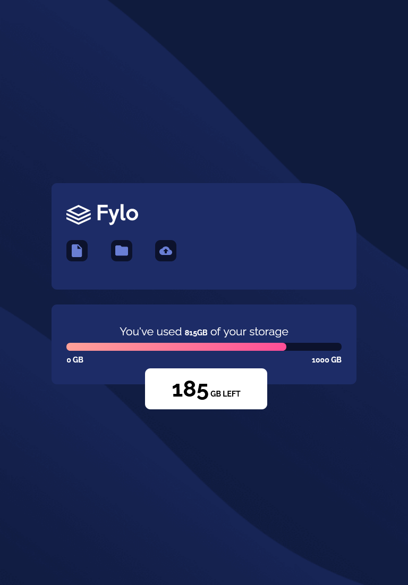
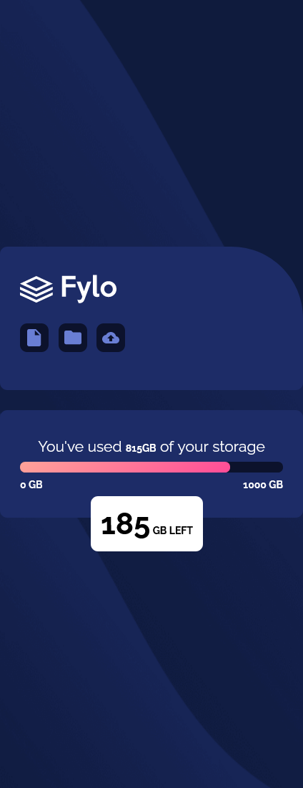

# Frontend Mentor - Fylo data storage component

This is a solution to the [Fylo data storage component challenge on Frontend Mentor](https://www.frontendmentor.io/challenges/fylo-data-storage-component-1dZPRbV5n).

## Overview

### The challenge

Users should be able to:

- View the optimal layout for the site depending on their device's screen size

### Screenshot

### Links

- Live Site URL: [Click Here](https://talktodeego.github.io/fem-datastorage/)

### Built with

- Semantic HTML5 markup
- CSS custom properties
- Flexbox
- CSS Grid

## Author

- Frontend Mentor - [@talkotdeego](https://www.frontendmentor.io/profile/talktodeego)
- Linkedin - [@diegoboscolo](https://www.linkedin.com/in/diegoboscolo/)
